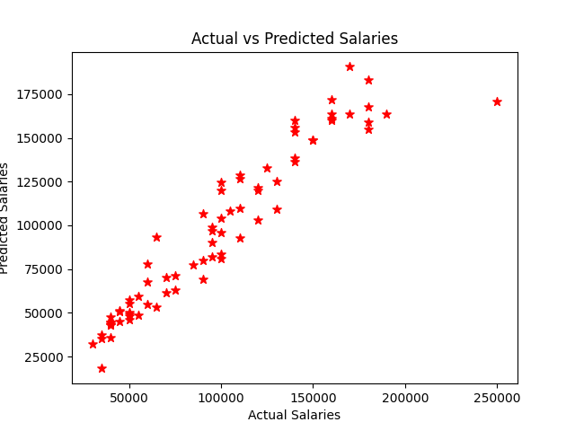

# 💼 Salary Prediction using Machine Learning

This project predicts the salary of an individual based on their years of experience using a simple Linear Regression model.

## 📁 Files Included
- `Untitled5.ipynb` – Main Jupyter Notebook file containing the code for data preprocessing, training, testing, and visualization.
- `output.png` – Output graph showing the regression line and prediction results.

## 🧠 Model Used
- **Linear Regression** from scikit-learn

## 🎯 Model Accuracy
- Achieved an accuracy of **91%**

## 📊 Libraries Used
- Pandas
- NumPy
- Matplotlib

## 🔍 Project Overview
- Load and visualize salary data
- Preprocess and split data
- Train a Linear Regression model
- Predict salaries
- Plot results

## 📷 Output

## 🚀 How to Run
1. Clone the repository
2. Open `Untitled5.ipynb` in Jupyter Notebook
3. Run all cells to see the predictions and graph

---

